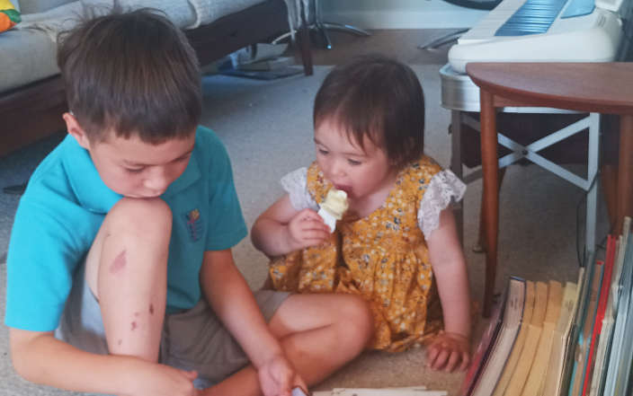
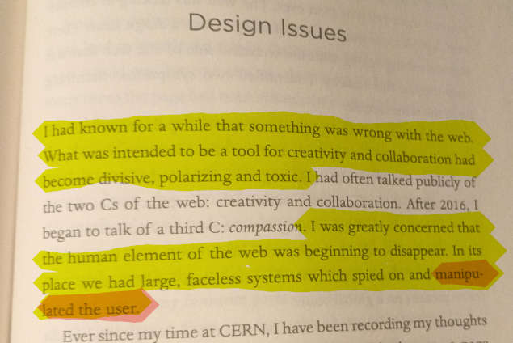
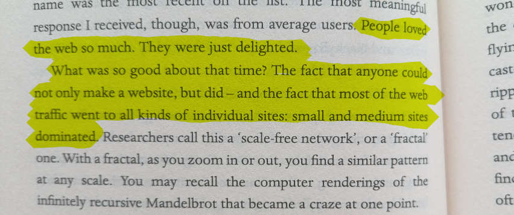

## Where are we going?

### It's right to be worried

When Peter Thiel &mdash; one of the most quietly powerful people on the planet &mdash; thinks **technological progress should reduce reliance on human labour**, we should listen.

When Tyler Cowen &mdash; a favourite economist among the techbro elite &mdash; thinks **labour is a tax on productivity**, we should listen.

These aren't visions of human flourishing, **these are visions of humans as high cost, low-value data sources**.

Maybe as capitalists it's always been the case that we've viewed human labour not as an asset, but as a liability. Now that sentiment is super-charged and looking right at the <a href="https://www.mediaite.com/media/tv/we-risk-revolution-scott-galloway-goes-on-epic-tirade-over-ceo-murder-and-out-of-control-wealth-inequality/" target="_blank" data-tooltip="This entire system is rigged, and it is rigged against [workers] and rigged for billionaires." class="popout tooltip">middle class, the greatest invention of the 20th century</a>, as Scott Galloway puts it.

### Workers on computers look very expensive 

**As a teacher of computing undergraduates, I am seeing this firsthand.** I'm certain there has been a shift in thinking at the executive level, a thinking that goes: 

>$100,000 for a human?! Every year?! How can a human be worth that much? Surely AI can do that now?

And:

>$50,000 to make that [app, website, campaign, RFP, contract...]?! Surely AI can do that now? 

**Young people will increasingly find themselves in a series of gig-like hustles** &mdash; sold to them as flexible and entrepreneurial &mdash; that mean ideas like owning a home to raise a stable family in a stable community look even more fantastical.

## He tāngata, he tāngata, he tāngata

It's an over-used whakataukī, but the direction bigtech is taking us is antithetical to what the inventor of the web imagined. 

>"This organic, emergent structure of the early web was a fragile thing of beauty and I was greatly impressed by it. Unfortunately, it doesn't much resemble the web of today."

For Tim Berners-Lee, the web was in service to human creativity, collaboration, and discovery. 

*Yes, we collaborate in Google Docs, but Gemini is joining the chat.*

Tools like Slack for work chat and Instagram for sharing photos with friends were meant to help us, but these companies are spending $millions on-the-daily to get us to use them more than we did yesterday, *more than is good for us*.

**When we're on bigtech platforms more than is good for us, societally, things get shitty.**

## Back to the future

I really am trying to check my nostalgia, but on most societal, wellbeing, and outlook measures, the 1990's was a better time. 

**Yes, we didn't have iphones and social media and AI, but then, we didn't have iphones and social media and AI.**

It's not just me, something is going on when <a href="https://medium.com/@www.irfanulhaqm/why-gen-z-is-obsessed-with-nostalgia-they-never-lived-317dcb17d96e" target="_blank" data-tooltip="Why is an entire generation romanticizing an era they never actually experienced? Is it just a fashion trend—or is there something deeper going on?" class="popout tooltip">Gen Z are nostalgic for a life they never lived</a>.

>"The 80s and 90s seem like eras when people talked more, scrolled less. No one was documenting every meal or doomscrolling before bed. Landline phones, handwritten notes, outdoor games—these feel oddly comforting to a generation raised on instant everything. Nostalgia becomes a form of emotional escape—a borrowed memory of a world that felt slower, warmer, and more human."

Tim Berners-Lee is nostalgic for that time too.

>"People loved the web so much. They were just delighted.
>What was good about that time? The fact that anyone could not only make a website, but did &mdash; and the fact that most of the web traffic went to all kinds of individual sites: small and medium sites dominated."

### So, where am I going?

I'm using my time:
- Supporting and building sovereign technology and ventures. 
- Taking ownership of our corners of the web and our online identities. 
- Delighting one another with whimsical creations not made for the likes. 
- Providing tools to help us get off bigtech.
- And offline.
- Advocating for learning useful long-term skills. 
- Advocating for a fair politcal economy for our rangatahi.
- **To live like it's the 90's and early noughties without nostalgia, for real.**