## The inevitable summer pause

Blog updates: one of those muscle-memory things lost to summer. 

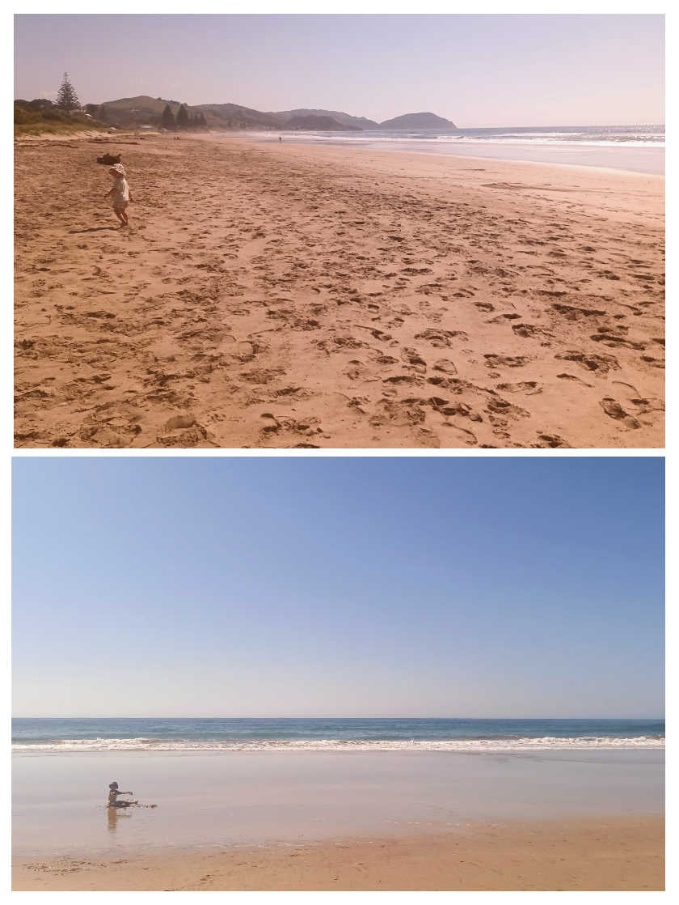

I should know by now it's stupid to think I'll power through the list of things to do in my digital projects. Even if the habit of 5am starts sticks, **the mindset is on supporting family**, especially as Dad winds down life.

Still, supporting my family did extend to **building a deck!** Of all the things I've created, digitally or otherwise, is this the thing I'm most proud of? Right now at least, totally!

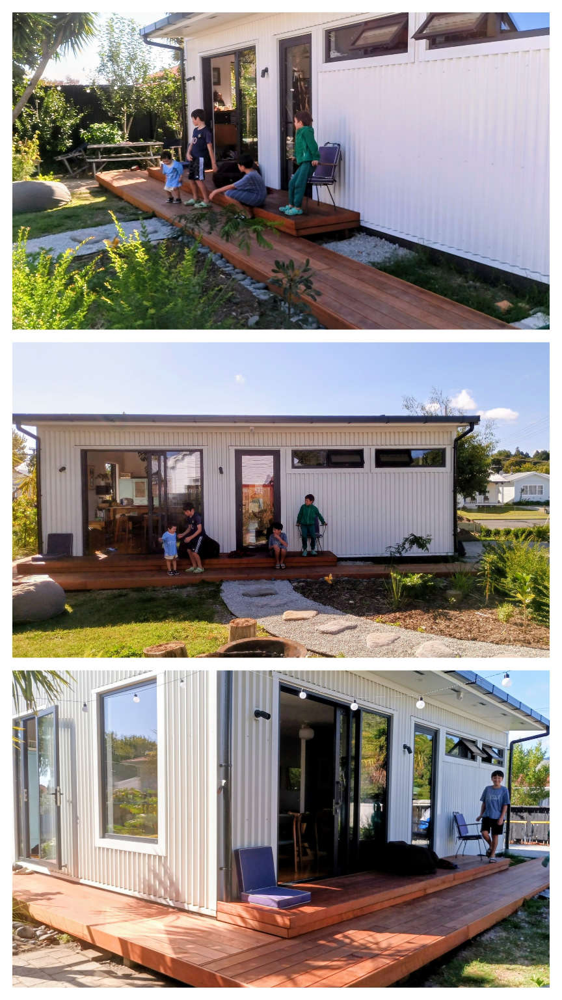

As for those Venture Designer plans that this site is supposed to be about, *some* progress has been made. 

## Saved

With [Saved](https://www.saved.co.nz), testing and UI configuring continued when I could. The focus has been on a *general purpose (GP)* build of a Saved laptop. It looks like there is significant demand in the training space, particularly around reintegration into work. The type of laptop that's perfectly great for an ordinary person who needs to learn/relearn office software, productivity, the web, communication, all that.

For general purpose computing for general folk who, from a support perspective you can't risk fiddling with Linux, [Bluefin](https://projectbluefin.io/) — based on Fedora — is fantastic. It's part of a new *immutable breed* of Linux. So, like a Chromebook, or an Android phone, it's very hard to break. Just install apps from the store, get image-based updates, and have an experience that's fast and familiar to anyone used to a modern mobile device.

With some considered configuring, **it's looking good!**

### Saved sign in
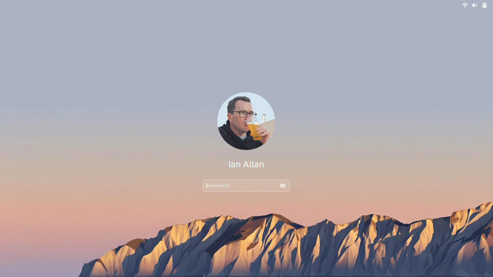
### Saved signed in
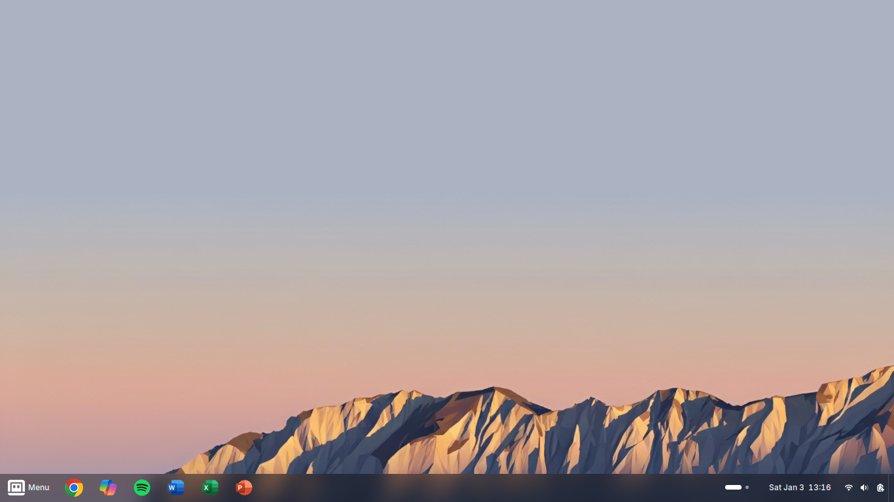
### Saved menu familiarity
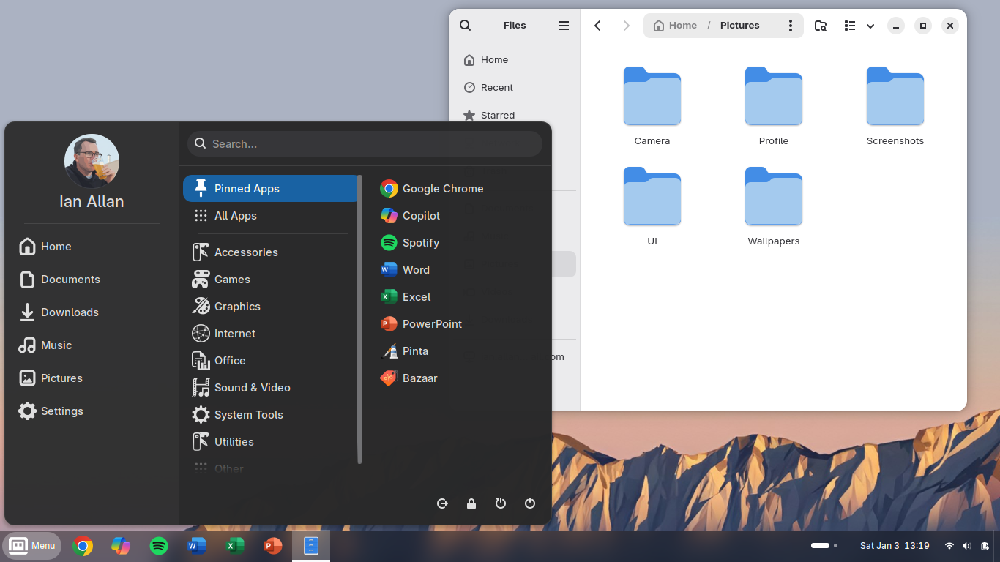
### Saved Microsoft apps!
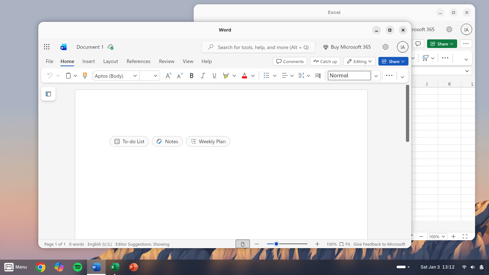
### Saved multi-workspace productivity
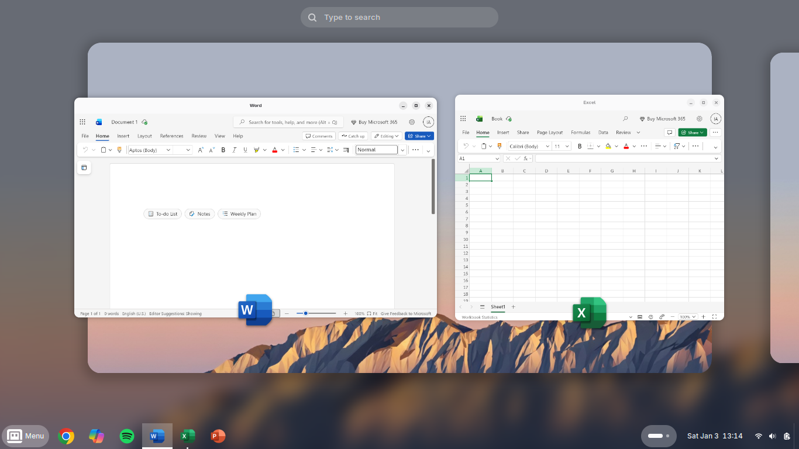
### Saved pro-level web apps
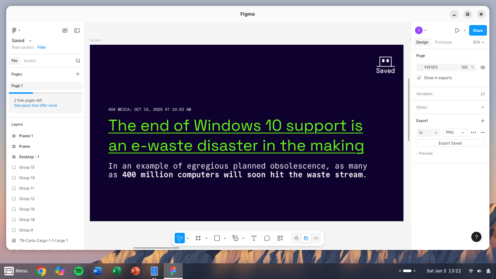
### Saved apps, like a smartphone
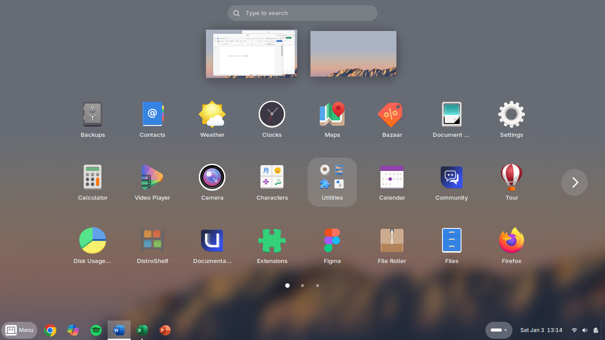

I'm still using Zorin OS on my serious Saved development laptop (where the next iteration of the Saved website's sitting), but my Saved GP laptop has been my daily driver for everything from documents, to YouTube, to my young son learning Python. 

## Pockit

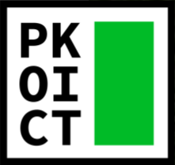

I haven't forgotten about my long-time rumination, Pockit. There's a full range of products in the roadmap, with the primary ones being the *Pockit Book* and the *Pockit Note*. But there's an emergent opportunity to bump the **Pockit Course** up the roadmap.

### Pockit Course

With a Pockit Course, students receive a set of 5-6 smartphone-sized Pockit Cards per lesson. 

Pockit Cards cover everything that is needed in a lesson, from QR codes to online resources, to provocation activities, to spaces for reflection. 

Pockit Cards slot into the Pockit Course folder as students progress, so that by the end of the course students have a Pockit Course body of learning that they can put in their pocket instead of their phone — great for revision!

#### And here's the trick

**No teacher has the time or inclination to create beautiful little Pockit Cards for a semester's worth of teaching.** Let alone a whole Pockit Course all at once. 

But as teachers we do prepare a lesson plan and resources for each week. 

So I've built a system where I just need to drop 5-6 simple markdown files with into a folder and it's published to the web as lovely online resources. But also, click the print button for the week and it recreates the week's Pockit Cards into a mm-perfect 4-up format ready for printing and quick cutting using the guides (students will happily do this bit).

Excited to share the alpha ASAP... the semester at EIT starts in 2 weeks!

## Back to work

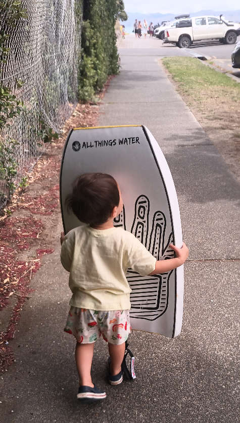

There's a lot going on. So as a beloved old boss would say: **Just f*cking get on with it.**

